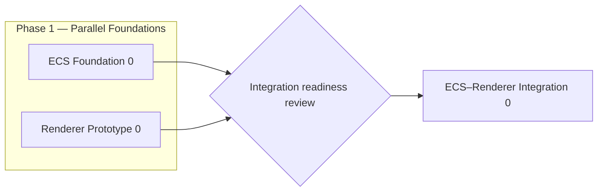

# Frogbyte Charter

> [!IMPORTANT]
> This charter defines the project's direction and the boundaries of the current phase. Detailed implementation requirements belong in milestone, architecture, and engineering documents.

| Field | Current value |
|---|---|
| **Status** | `Draft` |
| **Charter version** | `0.1` |
| **Last reviewed** | `2026-07-26` |
| **Current phase** | Phase 1 — Parallel Foundations |
| **Primary implementation language** | Rust |
| **Initial platform** | Windows x86-64 |
| **Distribution model** | Proprietary — source code publicly visible |
| **API stability** | Experimental|

## 1. Purpose

We are building a 3D game engine in Rust to:

- learn game-engine and graphics architecture in depth;
- research data-oriented design, ECS storage, scheduling, and rendering;
- retain control over technical and creative decisions;
- build technology that the team can understand, measure, and evolve deliberately;
- eventually support games with unconventional visual and technical directions.

The project is both an engineering effort and a research environment. Experiments are encouraged, but they do not become part of the core without evidence that they improve the project.

## 2. Long-term vision

> Build a deeply modifiable, data-oriented 3D game engine in Rust that enables developers to understand and control the cost of its abstractions and to create games with unconventional visual and technical directions.

The long-term engine should provide meaningful control over systems such as ECS storage and scheduling, rendering pipelines, assets, scene extraction, and other performance-sensitive subsystems.

This vision is directional. It is not a promise that all engine systems will be delivered during the current phase.

## 3. Current mission

Phase 1 establishes two independent foundations in parallel:

1. **ECS Foundation 0** — a correct, measurable, sequential, component-level SoA ECS.
2. **Renderer Prototype 0** — a minimal 3D renderer used to discover graphics requirements through implementation.

The tracks may progress simultaneously. Neither track should depend on unstable internal details of the other.

> [!NOTE]
> The renderer track is not a later phase of the ECS track. Both are parallel milestones inside the same project phase.

## 4. Intended users

### Current users

During Phase 1, the primary users are the engine team itself and technical readers and reviewers interested in engine internals, ECS design, graphics programming, and performance engineering.

They need:

- understandable architecture;
- measurable behavior;
- explicit performance costs;
- documented safety assumptions;
- room for controlled experimentation.

### Long-term users

The long-term engine targets advanced independent developers and small technical teams that need deep control over rendering and engine behavior, particularly for non-photorealistic or otherwise unconventional projects.

## 5. Current value proposition

Phase 1 aims to provide:

> A transparent and experimental Rust engine foundation whose correctness, safety assumptions, memory behavior, and performance can be studied and measured.

## 6. Project principles

### 6.1 Correctness before complexity

The simplest correct model is established before introducing advanced optimization, scheduling, or parallelism.

### 6.2 Measure before optimizing

Complexity enters the core only when supported by a clear hypothesis, representative measurements, and correctness validation.

### 6.3 Safe public APIs by default

Ordinary users should not need to write `unsafe` code. Necessary `unsafe` internals must be isolated, documented, reviewed, and tested according to the [Unsafe Code Policy](engineering/UNSAFE_POLICY.md).

### 6.4 Explicit costs

Important costs such as allocation, migration, synchronization, data movement, and cache invalidation should be discoverable rather than hidden behind convenient abstractions.

### 6.5 Controlled experimentation

Before version `1.0`, experimentation takes priority over API stability. Experimental work remains separate from accepted core behavior until supported by evidence.

### 6.6 Independent foundations

The ECS and renderer tracks may share repository infrastructure, conventions, and carefully selected foundational types. They must not couple through unstable storage or rendering internals.

### 6.7 Document important decisions

Major architectural decisions must record the problem, alternatives, selected direction, consequences, and conditions that would justify revisiting the decision.

## 7. Phase 1 boundaries

| Included |
|---|
| Sequential component-level SoA ECS |
| Generational entities and archetypes |
| Minimal independent 3D renderer | 
| Correctness, safety, and performance baselines |
| Initial CI and engineering policies | 
| Windows x86-64 as the initial runtime target |
| A future minimal extraction boundary | 

Detailed scope and completion criteria are defined in [here](https://github.com/orgs/FrogbyteEngine/projects/2/views/1)

## 8. Platform policy

| Concern | Phase 1 policy |
|---|---|
| Primary development platform | Windows x86-64 |

## 9. Decision authority

- Each track owner may decide implementation details local to that track.
- Changes affecting shared contracts require review from both track owners.
- Changes affecting the project vision, repository-wide engineering policy, public API policy, or ECS–renderer boundary require a documented joint decision.
- Unresolved architectural disagreements should lead to a time-boxed experiment or a written proposal rather than an undocumented unilateral change.

Track ownership should be recorded in repository metadata once maintainers are formally assigned.

## 10. Licensing and source visibility

This project is proprietary software whose source code is publicly visible.

Public access to the source code does not grant permission to use, copy,
modify, redistribute, sublicense, or commercially exploit the project,
except where explicitly permitted by the repository's license.

## 11. Major risks

| Risk | Response |
|---|---|
| Premature optimization makes correctness difficult to establish | Begin with sequential reference behavior and explicit validation |
| ECS and renderer become coupled too early | Keep both tracks independent until a small integration contract is justified |
| The team attempts too many systems at once | Keep milestones narrow and enforce their non-goals |
| `unsafe` code introduces soundness defects | Isolate it and apply the dedicated unsafe policy |
| Performance claims become misleading | Follow the benchmark policy and document limitations |
| The tracks drift apart | Review shared assumptions and integration readiness periodically |

## 12. Review policy

This charter must be reviewed:

- when either Phase 1 milestone is completed;
- before ECS–renderer integration begins;
- before scheduler development begins;
- when a major hypothesis is invalidated;
- when the long-term vision or project governance changes.

Important revisions must explain what changed, why it changed, and which milestones or contracts are affected.