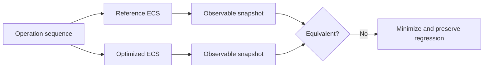

# Testing Strategy

## Goal

Use complementary forms of testing to detect semantic defects, invariant violations, undefined behavior, and integration failures. No single tool is treated as a complete proof.

## Test layers

| Layer | Main question | Typical cadence |
|---|---|---|
| Unit tests | Does one primitive behave correctly? | Every pull request |
| Integration tests | Do complete public workflows behave correctly? | Every pull request |
| Differential tests | Does the optimized implementation match the reference model? | Every pull request |
| Property tests | Do generated operation sequences preserve invariants? | Pull request or scheduled suite |
| Miri | Does compatible low-level code trigger detectable undefined behavior? | Scheduled and before milestone completion |
| Fuzzing | Can unexpected inputs or operation sequences break assumptions? | Scheduled |
| Renderer smoke tests | Can the graphics prototype initialize and execute expected paths? | Local and supported CI environments |

## Reference-model testing

The reference ECS should favor clarity over performance. Identical operation sequences are applied to both implementations.

Comparison ignores internal row order and allocation details unless the public API makes them observable.

## Failure preservation

When generated or fuzzed input exposes a failure:

1. minimize the sequence where practical;
2. store it as a deterministic regression test;
3. document the violated invariant;
4. fix the implementation rather than weakening the test without justification.
